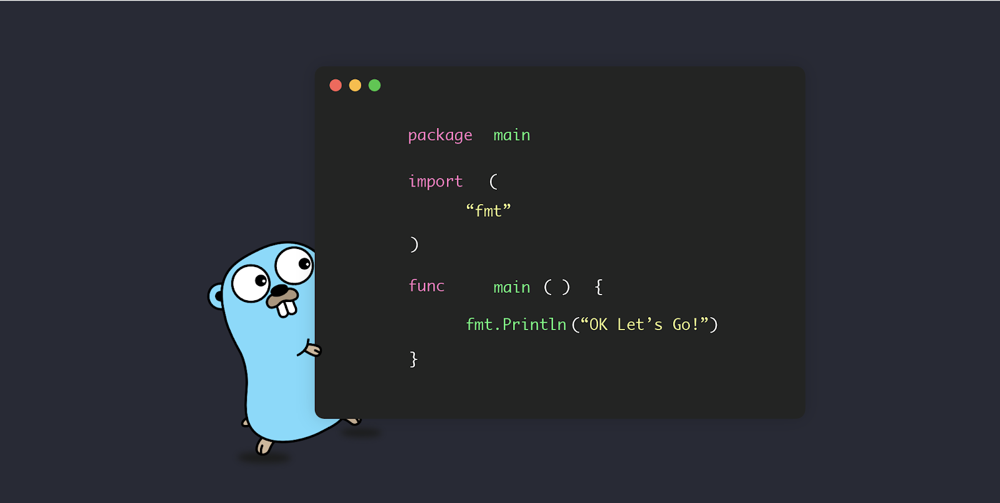

# Readme
This is a repo for learning Go, focusing on building scalable and reliable systems.

Embarking on the journey to learn the Go programming language is a strategic investment in your programming prowess. With its simplicity, efficiency, and modern design, Go offers a refreshing and streamlined approach to solving complex problems. As a language that prioritizes readability and productivity, Go's syntax is both accessible for beginners and a joy for experienced developers. Learning Go opens the door to a community known for its collaborative spirit and innovative mindset, providing ample support and resources for continuous growth. The language's exceptional concurrency features make it an ideal choice for building scalable systems, and its performance ensures that your applications run smoothly. Whether you're a seasoned developer looking to expand your skill set or a newcomer eager to dive into the world of programming, mastering Go will undoubtedly empower you to craft robust, high-performance software, and contribute to cutting-edge projects across a myriad of industries.
